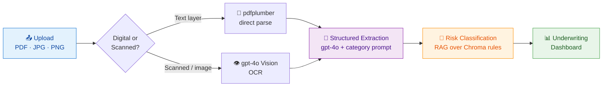

<div align="center">

# 🛡️ Underwriting

### AI-Assisted Insurance Underwriting Workbench

*Upload application, financial & medical documents — get structured data extraction plus a RAG-grounded risk dashboard.*

<br/>


</div>

---

## ✨ What it does

Upload the documents for a case and the workbench returns:

| Output | Description |
|:--|:--|
| 📑 **Structured extraction** | Personal, occupational, financial, health & lab fields parsed into a fixed JSON schema |
| 🚦 **Risk classification** | Every risk feature tagged **LOW / MEDIUM / HIGH** with a rule-grounded reason |
| 🔍 **Mismatch checks** | Cross-document consistency for **name, age & income** |
| 📊 **Dashboard** | Combined payload rendered as an underwriting summary |

---

## ⚙️ How it works



<table>
<tr><td width="30"><b>1️⃣</b></td><td><b>Extraction</b> — Uploaded files are routed through one of two paths:<br/>• <b>Digital PDFs</b> (text layer present) → parsed directly with <code>pdfplumber</code><br/>• <b>Scanned PDFs / images</b> → rendered to an image and sent to <code>gpt-4o</code> vision to OCR the text</td></tr>
<tr><td><b>2️⃣</b></td><td><b>Structured extraction</b> — Raw text from each document category (application, financial, medical) is sent to <code>gpt-4o</code> with a category-specific prompt returning a fixed JSON schema — personal details, occupation, avocations, lifestyle, health, financials, lab results — including derived fields like <b>income coverage ratio</b>, <b>EMI-to-income ratio</b> and <b>income consistency flags</b></td></tr>
<tr><td><b>3️⃣</b></td><td><b>Risk classification (RAG)</b> — Extracted fields are matched against a <b>Chroma</b> vector store of underwriting rules (built by <code>rag_setup.py</code>) to classify each risk feature as LOW/MEDIUM/HIGH with a rule-grounded reason, and to compute cross-document mismatch checks</td></tr>
<tr><td><b>4️⃣</b></td><td><b>Dashboard</b> — The frontend renders the combined payload as an underwriting summary dashboard</td></tr>
</table>

---

## 🗂️ Project structure

```
Underwriting/
├── 🐍 backend/
│   ├── main.py            # FastAPI app: /extract and /analyse endpoints
│   ├── rag_setup.py       # Builds/seeds the Chroma collections (underwriting rules)
│   ├── rag_classify.py    # Queries Chroma + classifies risk, computes mismatches
│   ├── test_rag_query.py  # Manual script for testing RAG queries
│   ├── requirements.txt
│   ├── chroma_db/         # Persisted vector store (generated, gitignored)
│   └── .env               # OPENAI_API_KEY, CHROMA_DIR (not committed)
└── ⚛️ frontend/
    ├── src/
    │   ├── App.jsx        # Upload UI, calls backend /extract and /analyse
    │   ├── Dashboard.jsx  # Risk dashboard rendering
    │   └── data/mockCase.json
    ├── package.json
    └── vite.config.js
```

---

## 📋 Prerequisites

- 🐍 **Python** 3.10+
- 🟢 **Node.js** 18+
- 🔑 An **OpenAI API key** with access to `gpt-4o` and `text-embedding-3-small`
- 🖼️ **[Poppler](https://poppler.freedesktop.org/)** for PDF→image conversion — the scanned-PDF path uses `pdf2image`, which shells out to Poppler's `pdftoppm`. On Windows, install Poppler and update the `poppler_path` in `backend/main.py` (`extract_with_vision`) to match your install location.

---

## 🚀 Setup

### 🐍 Backend

```bash
cd backend
python -m venv venv
venv\Scripts\activate        # Windows
# source venv/bin/activate   # macOS/Linux
pip install -r requirements.txt
```

Create `backend/.env`:

```env
OPENAI_API_KEY=sk-...
CHROMA_DIR=C:\path\to\Underwriting\backend\chroma_db
```

Build the vector store of underwriting rules *(only needed once, or whenever `rag_setup.py`'s rule content changes)*:

```bash
python rag_setup.py
```

Run the API:

```bash
uvicorn main:app --reload --port 8000
```

> 💡 The backend expects requests from `http://localhost:5173` (see CORS config in `main.py`) — update `allow_origins` if the frontend runs elsewhere.

### ⚛️ Frontend

```bash
cd frontend
npm install
npm run dev
```

> 💡 Runs on `http://localhost:5173` by default (Vite). The backend base URL is currently hardcoded in `src/App.jsx` as `http://localhost:8000`.

---

## 🔌 API

### `POST /extract`
> Extracts raw text from a single uploaded file.

| | |
|:--|:--|
| **Body** | `multipart/form-data`, field `file` |
| **Response** | `{ filename, extraction_method, extracted_text }` |

### `POST /analyse`
> Runs the full pipeline for a case: extraction + structured field parsing + RAG risk classification, across up to three document categories.

| | |
|:--|:--|
| **Body** | `multipart/form-data` with optional repeated fields: `application_files`, `financial_files`, `medical_files` |
| **Response** | `{ application, financial, medical, ...dashboard_payload }` |

### `GET /`
> Health check — returns `{ "status": "Underwriting Backend Running" }`.

---

## 🔐 Environment variables

| Variable | Where | Purpose |
|:--|:--|:--|
| `OPENAI_API_KEY` | `backend/.env` | Auth for OpenAI extraction/classification calls |
| `CHROMA_DIR` | `backend/.env` | Path to the persisted Chroma vector store |

> ⚠️ `.env` is **gitignored** — never commit real keys. Rotate the key immediately if it's ever exposed in a commit, log, or screenshot.

---

## ⚠️ Notes / known limitations

- 🖥️ The Poppler path in `main.py` is hardcoded to a local Windows install path — adjust for your machine or make it configurable via env var if this needs to run cross-platform or in CI/containers.
- 🔗 The frontend backend URL (`API_URL` in `App.jsx`) is hardcoded rather than read from a Vite env var — fine for local dev, but should move to `import.meta.env.VITE_API_URL` before deploying anywhere beyond localhost.
- 🗄️ `chroma_db/` is a local persisted store; it isn't committed, so a fresh clone must run `python rag_setup.py` before `/analyse` will work.

<div align="center">

<br/>

*Built with FastAPI · React · gpt-4o · Chroma*

</div>